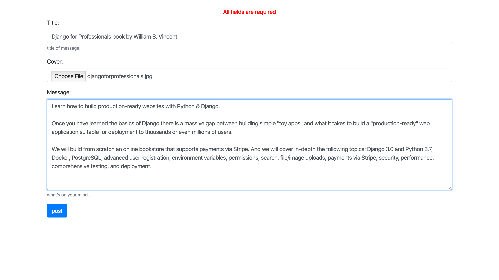
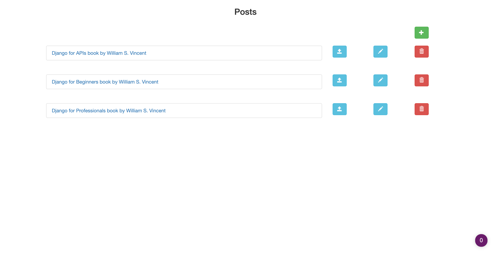

# Django CRUD Web Application

## Packages

* django = "*"
* django-widget-tweaks = "*"
* pillow = "*"

## Tutorial reference

Build a Django CRUD Web Application (Part I) - <https://medium.com/@john.bagiliko/django-crud-web-application-77ef05af1f00>

Build a Django CRUD Web Application (Part II) - <https://medium.com/@john.bagiliko/build-a-django-crud-web-application-part-ii-4dbce965ce1d>